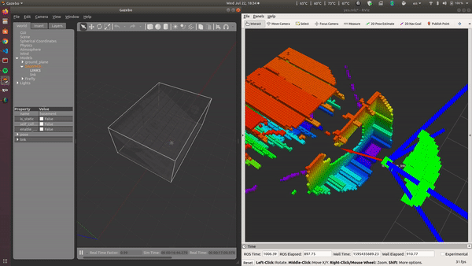
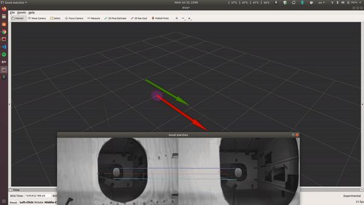

# Adaptive path planning for UAV based exploration in complex confined spaces

Master thesis:
Researched topics:
1. Exploration
2. Hole Detection
3. Visual Odometry --> towards Visual Servoing

Explanation on how to install everything, run the code, references and other explanations will be added in the future update

## Demos 

Exploration

Hole Detection

Visual Odometry
